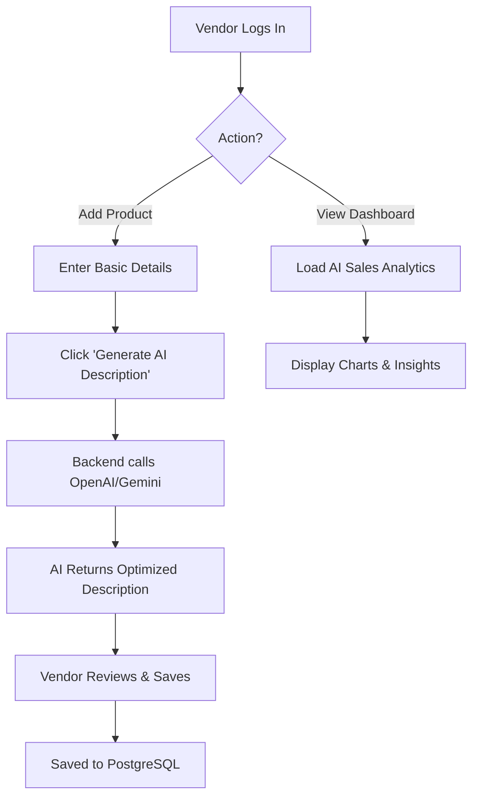

# CommerceIQ AI
## Business Requirements Document (BRD)

---

## 1. Cover Page
**Project Name:** CommerceIQ AI
**Project Type:** AI-Powered E-Commerce Administration & Business Intelligence Platform
**Document Version:** 1.0
**Date:** June 24, 2026
**Prepared By:** Senior Business Analyst & Solution Architect
**Target Audience:** Project Sponsors, Stakeholders, Product Managers, Development Team, QA Team

---

## 2. Document Information
| Field | Details |
| :--- | :--- |
| **Document Name** | CommerceIQ AI Business Requirements Document |
| **Project Name** | CommerceIQ AI |
| **Document Owner** | Product Owner / Senior BA |
| **Status** | Draft |
| **Creation Date** | 2026-06-24 |
| **Last Modified Date**| 2026-06-24 |

---

## 3. Revision History
| Version | Date | Author | Description of Changes |
| :--- | :--- | :--- | :--- |
| 1.0 | 2026-06-24 | Senior BA | Initial BRD creation based on stakeholder requirements |

---

## 4. Approval Matrix
| Name | Role / Title | Signature | Date | Status |
| :--- | :--- | :--- | :--- | :--- |
| [Name] | Chief Executive Officer (CEO) | | | Pending |
| [Name] | Chief Technology Officer (CTO) | | | Pending |
| [Name] | Product Manager | | | Pending |
| [Name] | Lead Architect | | | Pending |

---

## 5. Executive Summary
CommerceIQ AI is a next-generation, AI-powered e-commerce administration and Business Intelligence (BI) platform designed to streamline operations, enhance decision-making, and automate repetitive tasks. By integrating advanced AI services (OpenAI, Gemini), the platform empowers e-commerce businesses to optimize product listings, forecast inventory, analyze customer sentiment, and derive actionable sales analytics. The platform serves administrators, vendors, and business analysts through a centralized, highly scalable web application built on modern web technologies.

---

## 6. Business Background
Modern e-commerce operations require analyzing vast amounts of data, managing complex inventories, and continuously optimizing digital storefronts. Traditional admin panels lack intelligent automation, leaving store owners and vendors reliant on manual data analysis, manual product description writing, and reactive inventory management. There is a market gap for a unified, intelligent SaaS platform that not only manages standard e-commerce operations but actively assists users through AI-driven insights and automation.

---

## 7. Problem Statement
E-commerce managers and vendors currently face the following challenges:
*   **Time-Consuming Catalog Management:** Writing SEO-optimized product descriptions and categorizing products is manual and slow.
*   **Inefficient Inventory Management:** Lack of predictive forecasting leads to overstocking or stockouts.
*   **Data Overload:** Difficulty in extracting actionable insights from sales and customer data without dedicated data analysts.
*   **Reactive Customer Service:** Inability to quickly synthesize and respond to customer reviews and sentiment trends.

---

## 8. Business Objectives
*   **Automate Content Creation:** Reduce product cataloging time by 70% using AI-generated product descriptions.
*   **Optimize Inventory:** Decrease stockouts by 30% through AI-driven inventory forecasting within the first 6 months.
*   **Enhance Decision Making:** Provide real-time, AI-driven sales analytics and actionable business recommendations.
*   **Improve Customer Satisfaction:** Utilize AI sentiment analysis to proactively identify and address product issues highlighted in customer reviews.

---

## 9. Scope Definition

### In Scope
*   Development of a responsive web-based admin portal (Next.js, Tailwind CSS).
*   Backend API development (Node.js, Express.js) with a robust PostgreSQL database.
*   Implementation of Role-Based Access Control (RBAC) utilizing JWT.
*   Integration of AI modules via OpenAI API and Gemini API for content generation, forecasting, and sentiment analysis.
*   Standard business modules: User, Vendor, Product, Category, Inventory, Order, Refund, and Customer Management.
*   Comprehensive BI Dashboards and Reporting.

### Out of Scope
*   Customer-facing storefront (B2C shopping app/website).
*   Payment gateway integration for end-customer purchases (platform assumes orders are ingested from external storefronts).
*   Physical warehouse robotics integration.
*   Mobile application development (iOS/Android).

---

## 10. Stakeholder Analysis
| Stakeholder | Role | Interests & Expectations | Influence |
| :--- | :--- | :--- | :--- |
| **Executive Sponsors** | Funding & Strategic Direction | High ROI, market competitiveness, successful deployment | High |
| **Product Manager** | Product Vision & Roadmap | Timely delivery, feature completeness, user adoption | High |
| **Platform Admins** | Day-to-day operations oversight | Ease of use, comprehensive controls, system reliability | High |
| **Vendors / Sellers** | Managing their own products/orders | Increased sales, easy product onboarding, accurate forecasting | Medium |
| **Development Team** | Implementation | Clear requirements, modern tech stack, architectural scalability | Medium |

---

## 11. User Personas
1.  **Super Admin (Alice):** Needs full visibility across the platform to manage vendors, monitor global sales, and configure system settings. Wants AI insights to guide overall platform strategy.
2.  **Vendor (Bob):** Needs an intuitive interface to add products, process orders, and manage inventory. Highly values the AI Product Description Generator to save time.
3.  **Business Analyst (Charlie):** Requires access to deep analytics, AI Sales Analytics, and custom reporting tools to identify trends and present findings to management.

---

## 12. Business Requirements
| Req ID | Requirement Name | Priority | Description | Business Justification |
| :--- | :--- | :--- | :--- | :--- |
| BR-01 | AI Content Automation | High | The system must automate product descriptions using AI. | Reduces manual effort and standardizes catalog quality. |
| BR-02 | Multi-tenant Vendor Support | High | The platform must allow multiple vendors to manage their distinct catalogs and orders. | Enables a marketplace model, increasing platform revenue. |
| BR-03 | Predictive Analytics | High | The platform must forecast inventory needs based on historical data. | Prevents revenue loss from stockouts and reduces holding costs. |
| BR-04 | Secure Authentication | Critical | Implement robust JWT + Refresh Token authentication. | Protects sensitive commercial and PII data. |

---

## 13. Functional Requirements
| Req ID | Requirement Name | Priority | Description | Business Justification |
| :--- | :--- | :--- | :--- | :--- |
| FR-01 | User Registration & Login | Critical | System shall allow users to register and login using email/password with JWT issuing. | Foundation for secure access control. |
| FR-02 | Vendor Onboarding | High | System shall provide a workflow for Super Admins to approve/reject new vendor applications. | Maintains platform quality and trust. |
| FR-03 | Product CRUD | High | Vendors shall be able to Create, Read, Update, and Delete their products. | Core operational capability for vendors. |
| FR-04 | Order Status Management | High | System shall allow updating order status (e.g., Pending, Shipped, Delivered). | Necessary for fulfillment tracking. |
| FR-05 | Refund Processing | Medium | System shall allow logging and updating the status of customer refunds. | Ensures accurate financial tracking and customer service. |

---

## 14. Non-Functional Requirements
| Req ID | Requirement Name | Priority | Description | Business Justification |
| :--- | :--- | :--- | :--- | :--- |
| NFR-01 | Performance | High | Dashboard must load within 2 seconds under normal load. | Ensures a smooth, professional user experience. |
| NFR-02 | Scalability | High | Backend architecture must handle up to 10,000 concurrent users. | Accommodates business growth without system redesign. |
| NFR-03 | Availability | High | The platform must achieve 99.9% uptime. | Prevents business interruption for administrators and vendors. |
| NFR-04 | Maintainability | Medium | Code must be fully typed (TypeScript) and modular. | Reduces future technical debt for the 5-member dev team. |

---

## 15. Business Rules
*   **BRU-01:** A Vendor can only view, edit, and delete products that belong to their specific account.
*   **BRU-02:** AI API calls (OpenAI/Gemini) must be rate-limited per vendor to manage platform costs.
*   **BRU-03:** Refunds can only be processed if the order status is 'Delivered' or 'Returned'.
*   **BRU-04:** Passwords must meet complexity requirements (min 8 chars, 1 uppercase, 1 number, 1 special character).

---

## 16. Assumptions
*   External e-commerce storefronts will push orders into this platform via standard REST APIs.
*   The 5-member team has the necessary skills in Next.js, Node.js, and AI integrations.
*   OpenAI and Gemini APIs will remain available and within the projected operational budget.

---

## 17. Constraints
*   **Time Constraint:** The initial MVP must be delivered within the agreed 4-month timeline.
*   **Resource Constraint:** Development is limited to the current 5-member team.
*   **Technology Constraint:** Must deploy exclusively on Vercel (Frontend) and Render (Backend) to minimize DevOps overhead.

---

## 18. Risk Analysis
| Risk ID | Risk Description | Probability | Impact | Mitigation Strategy |
| :--- | :--- | :--- | :--- | :--- |
| RSK-01 | AI API Downtime / Latency | Medium | High | Implement fallback mechanisms, caching, and failover between OpenAI and Gemini. |
| RSK-02 | Data Privacy Breaches | Low | Critical | Ensure strict PostgreSQL access controls, JWT security, and encryption at rest/transit. |
| RSK-03 | Scope Creep on AI Features | High | Medium | Strictly adhere to the approved MVP feature list. Use agile sprint planning to manage backlog. |

---

## 19. User Roles & Permissions
| Role | Description | Key Permissions |
| :--- | :--- | :--- |
| **Super Admin** | Platform Owner | Full CRUD on all modules, Vendor Approval, Global Analytics, AI Config. |
| **Vendor Admin** | Store Owner | CRUD on own Products, Inventory, Orders. View own Analytics & AI insights. |
| **Analyst** | Data professional | Read-only access to Global Analytics, Custom Reporting, AI Sales Analytics. |
| **Support Staff**| Customer Service | View Orders, Manage Refunds, View Customer Profiles, View Review Sentiments. |

---

## 20. Process Flow Diagrams (Mermaid)

---

## 21. High-Level Business Workflow
1.  **Vendor Registration:** Vendor signs up; Super Admin approves the account.
2.  **Catalog Creation:** Vendor utilizes the AI Product Description Generator to quickly build their catalog.
3.  **Order Ingestion:** Orders flow into the system from external storefronts.
4.  **Fulfillment & Inventory:** Vendor processes orders. AI Inventory Forecasting alerts the vendor when stock is running low based on predictive trends.
5.  **Customer Feedback:** Reviews are ingested; AI Sentiment Analysis categorizes them into Positive/Neutral/Negative.
6.  **Business Strategy:** Vendors and Admins review the AI Business Recommendation Engine to optimize pricing and marketing.

---

## 22. Use Cases
| Use Case ID | Name | Actor | Description |
| :--- | :--- | :--- | :--- |
| UC-01 | Generate Product Description | Vendor | Vendor inputs product name and keywords; AI generates a full SEO description. |
| UC-02 | Predict Stock Requirements | Vendor | Vendor views inventory dashboard; AI highlights items likely to stock out in 30 days. |
| UC-03 | Analyze Global Sales | Analyst | Analyst queries platform for Q3 sales trends; AI generates a natural language summary. |

---

## 23. User Stories
*   **US-01:** As a Vendor, I want to click a button to generate an AI product description so that I can list items faster.
*   **US-02:** As a Super Admin, I want to see a dashboard of AI-generated business recommendations so that I can identify new revenue opportunities.
*   **US-03:** As Support Staff, I want to see an AI sentiment score next to customer profiles so that I can prioritize unhappy customers.

---

## 24. Acceptance Criteria
*   **For US-01 (AI Description):** 
    *   Given the user is on the Add Product page, when they enter "Wireless Mouse" and click "Generate", then a description of at least 100 words is populated in the text box within 5 seconds.
*   **For US-03 (Sentiment):** 
    *   Given a customer review is submitted, when the system processes it, then it is tagged as Positive, Neutral, or Negative with >85% confidence.

---

## 25. Success Metrics (KPIs)
*   **Time to Market:** Average time to list a new product is reduced by 50%.
*   **Inventory Accuracy:** Number of 'Out of Stock' incidents decreases by 20% month-over-month.
*   **System Usage:** AI feature utilization rate > 70% among active vendors.
*   **Performance:** API response times average < 300ms.

---

## 26. Reporting Requirements
*   **Daily Sales Report:** Aggregated sales volume, revenue, and top-selling products (exportable to CSV/PDF).
*   **Inventory Health Report:** Current stock levels, holding costs, and AI-predicted stockout dates.
*   **Vendor Performance:** Comparative analytics showing revenue generation per vendor.

---

## 27. Notification Requirements
| Notification Type | Trigger | Channel | Target Audience |
| :--- | :--- | :--- | :--- |
| Low Stock Alert | Inventory drops below AI-predicted safety threshold | In-App / Email | Vendor Admin |
| New Order Received | Order ingested into the system | In-App | Vendor Admin |
| Negative Sentiment Spike | AI detects >10 negative reviews in 1 hour | Email | Support Staff / Super Admin |

---

## 28. Audit & Compliance Requirements
*   **Action Logging:** All CRUD operations on Users, Vendors, and Orders must be logged with timestamp and user ID.
*   **Data Retention:** Audit logs must be retained in PostgreSQL for a minimum of 1 year.
*   **GDPR/CCPA Compliance:** Implement features for user data export and "Right to be Forgotten" (data anonymization/deletion).

---

## 29. Security Requirements
*   **Authentication:** Passwords must be hashed using bcrypt. Access must be governed by JWT access tokens (short-lived) and refresh tokens (HTTP-only cookies).
*   **API Security:** Express backend must implement Helmet.js, CORS policies, and rate-limiting to prevent DDoS and brute force attacks.
*   **Data Encryption:** All data in transit must use HTTPS/TLS 1.2+.

---

## 30. AI Features Requirements

### 30.1 AI Product Description Generator
| Req ID | Requirement Name | Priority | Description | Business Justification |
| :--- | :--- | :--- | :--- | :--- |
| AI-01 | Prompt Engineering | High | Backend must format user inputs (title, keywords) into a structured prompt for OpenAI/Gemini. | Ensures consistent, high-quality output. |
| AI-02 | SEO Optimization | High | The AI must be instructed to generate SEO-friendly content with relevant H1/H2 tags if requested. | Improves organic discovery of vendor products. |

### 30.2 AI Sales Analytics
| Req ID | Requirement Name | Priority | Description | Business Justification |
| :--- | :--- | :--- | :--- | :--- |
| AI-03 | Natural Language Querying | Medium | Allow users to ask "What were my top products last week?" and receive a data-backed answer. | Democratizes data access for non-technical users. |
| AI-04 | Trend Identification | High | AI must analyze historical PostgreSQL sales data to identify emerging trends and anomalies. | Proactive business intelligence. |

### 30.3 AI Inventory Forecasting
| Req ID | Requirement Name | Priority | Description | Business Justification |
| :--- | :--- | :--- | :--- | :--- |
| AI-05 | Demand Prediction | High | Utilize historical sales velocity and seasonality data to predict future stock requirements. | Optimizes supply chain and cash flow. |
| AI-06 | Reorder Point Calculation | Medium | AI suggests dynamic reorder points based on lead times and forecasted demand. | Automates procurement workflows. |

### 30.4 AI Customer Review Sentiment Analysis
| Req ID | Requirement Name | Priority | Description | Business Justification |
| :--- | :--- | :--- | :--- | :--- |
| AI-07 | Automated Tagging | High | All incoming reviews must be processed by the AI and tagged (Positive/Neutral/Negative). | Enables quick triage of customer issues. |
| AI-08 | Insight Extraction | Medium | AI must extract key themes from reviews (e.g., "Shipping delay", "Great quality"). | Identifies systemic product or operational issues. |

### 30.5 AI Business Recommendation Engine
| Req ID | Requirement Name | Priority | Description | Business Justification |
| :--- | :--- | :--- | :--- | :--- |
| AI-09 | Actionable Insights | High | System generates specific recommendations (e.g., "Bundle Product A and B", "Apply a 10% discount to slow-moving Product C"). | Drives revenue growth and strategic decision-making. |
| AI-10 | Performance Tracking | Low | Track the adoption and success rate of implemented AI recommendations. | Validates the ROI of the AI integrations. |

---
**End of Document**
