# CommerceIQ AI
## Enterprise Database Design & ERD Document

---

## 1. Document Information
| Field | Details |
| :--- | :--- |
| **Document Name** | Enterprise Database Design & ERD Document |
| **Project Name** | CommerceIQ AI |
| **Database Engine** | PostgreSQL (Relational) |
| **Architecture** | Multi-Tenant SaaS Architecture |
| **Document Owner** | Senior Database Architect |

---

## 2. Standard Audit Columns
Every table in this database strictly adheres to the following audit and soft-delete structure:
*   `id`: UUID (Primary Key)
*   `created_at`: TIMESTAMP DEFAULT CURRENT_TIMESTAMP
*   `updated_at`: TIMESTAMP DEFAULT CURRENT_TIMESTAMP
*   `created_by`: UUID (Foreign Key -> Users.id)
*   `updated_by`: UUID (Foreign Key -> Users.id)
*   `is_active`: BOOLEAN DEFAULT TRUE
*   `is_deleted`: BOOLEAN DEFAULT FALSE (Soft Delete Support)

---

## 3. Entity Relationship Diagram (Crow's Foot / Mermaid Format)

```mermaid
erDiagram
    %% AUTHENTICATION MODULE
    USERS ||--o{ REFRESH_TOKENS : has
    USERS ||--o{ USER_ROLES : assigned_to
    ROLES ||--o{ USER_ROLES : belongs_to
    ROLES ||--o{ ROLE_PERMISSIONS : has
    PERMISSIONS ||--o{ ROLE_PERMISSIONS : belongs_to

    %% VENDOR MANAGEMENT
    VENDORS ||--o{ VENDOR_ADDRESSES : has
    VENDORS ||--o{ VENDOR_DOCUMENTS : submits
    VENDORS ||--o| VENDOR_PERFORMANCE : tracked_by
    USERS ||--o| VENDORS : manages

    %% PRODUCT MANAGEMENT
    VENDORS ||--o{ PRODUCTS : sells
    CATEGORIES ||--o{ SUB_CATEGORIES : contains
    CATEGORIES ||--o{ PRODUCTS : categorizes
    PRODUCTS ||--o{ PRODUCT_IMAGES : displays
    PRODUCTS ||--o{ PRODUCT_VARIANTS : has
    PRODUCTS ||--o{ PRODUCT_ATTRIBUTES : possesses
    PRODUCT_ATTRIBUTES ||--o{ PRODUCT_ATTRIBUTE_VALUES : defines

    %% INVENTORY MANAGEMENT
    PRODUCTS ||--o{ INVENTORY : stocked_as
    WAREHOUSES ||--o{ INVENTORY : stores
    INVENTORY ||--o{ INVENTORY_TRANSACTIONS : logs
    INVENTORY ||--o{ STOCK_ALERTS : triggers

    %% CUSTOMER MANAGEMENT
    CUSTOMERS ||--o{ CUSTOMER_ADDRESSES : has
    CUSTOMERS ||--o{ CUSTOMER_PREFERENCES : sets
    CUSTOMERS ||--o{ WISHLIST : adds_to
    USERS ||--o| CUSTOMERS : maps_to

    %% ORDER MANAGEMENT
    CUSTOMERS ||--o{ ORDERS : places
    ORDERS ||--|{ ORDER_ITEMS : contains
    PRODUCTS ||--o{ ORDER_ITEMS : included_in
    ORDERS ||--o| PAYMENTS : processed_by
    ORDERS ||--o| SHIPPING_DETAILS : shipped_via
    ORDERS ||--o{ ORDER_STATUS_HISTORY : tracks

    %% REFUND MANAGEMENT
    ORDERS ||--o{ REFUND_REQUESTS : initiates
    REFUND_REQUESTS ||--o| REFUND_TRANSACTIONS : executes
    REFUND_REASONS ||--o{ REFUND_REQUESTS : justifies

    %% REVIEW MANAGEMENT
    PRODUCTS ||--o{ REVIEWS : receives
    CUSTOMERS ||--o{ REVIEWS : writes
    REVIEWS ||--o{ REVIEW_REPLIES : gets
    REVIEWS ||--o| REVIEW_SENTIMENTS : analyzed_as

    %% NOTIFICATIONS & AUDIT & AI
    USERS ||--o{ NOTIFICATIONS : receives
    NOTIFICATIONS }o--|| NOTIFICATION_TEMPLATES : formatted_by
    USERS ||--o{ AUDIT_LOGS : performs
    USERS ||--o{ AI_REQUESTS : initiates
    AI_REQUESTS ||--o| AI_RESPONSES : yields
```

---

## 4. Entity Definitions & Table Designs

*(Note: Standard audit columns defined in Section 2 are omitted below for brevity but are required on all tables).*

### 4.1 Authentication Module
*   **Users**: Stores login credentials. (Columns: `email` VARCHAR UNIQUE, `password_hash` VARCHAR, `last_login` TIMESTAMP).
*   **Roles**: System roles. (Columns: `name` VARCHAR UNIQUE, `description` TEXT).
*   **UserRoles**: Junction table. (Columns: `user_id` UUID FK, `role_id` UUID FK. Composite PK: `user_id, role_id`).
*   **Permissions**: Granular actions. (Columns: `action_name` VARCHAR UNIQUE).
*   **RolePermissions**: Junction table. (Columns: `role_id` UUID FK, `permission_id` UUID FK).
*   **RefreshTokens**: Session management. (Columns: `user_id` UUID FK, `token` VARCHAR UNIQUE, `expires_at` TIMESTAMP).

### 4.2 Vendor Management
*   **Vendors**: Vendor business profiles. (Columns: `user_id` UUID FK UNIQUE, `business_name` VARCHAR, `tax_id` VARCHAR UNIQUE).
*   **VendorAddresses**: Locations. (Columns: `vendor_id` UUID FK, `address_line1` VARCHAR, `city` VARCHAR, `type` VARCHAR).
*   **VendorDocuments**: KYC/Legal. (Columns: `vendor_id` UUID FK, `document_url` VARCHAR, `status` VARCHAR).
*   **VendorPerformance**: Metrics. (Columns: `vendor_id` UUID FK UNIQUE, `rating` DECIMAL, `fulfillment_rate` DECIMAL).

### 4.3 Product Management
*   **Categories**: Top-level tax. (Columns: `name` VARCHAR, `slug` VARCHAR UNIQUE).
*   **SubCategories**: Lower tax. (Columns: `category_id` UUID FK, `name` VARCHAR).
*   **Products**: Core catalog. (Columns: `vendor_id` UUID FK, `category_id` UUID FK, `title` VARCHAR, `sku` VARCHAR UNIQUE, `price` DECIMAL, `description` TEXT).
*   **ProductImages**: (Columns: `product_id` UUID FK, `image_url` VARCHAR, `is_primary` BOOLEAN).
*   **ProductVariants**: (Columns: `product_id` UUID FK, `variant_name` VARCHAR, `price_adjustment` DECIMAL).
*   **ProductAttributes**: (Columns: `product_id` UUID FK, `attribute_name` VARCHAR).
*   **ProductAttributeValues**: (Columns: `attribute_id` UUID FK, `value` VARCHAR).

### 4.4 Inventory Management
*   **Warehouses**: Storage locations. (Columns: `name` VARCHAR, `location` VARCHAR).
*   **Inventory**: Stock counts. (Columns: `product_id` UUID FK, `warehouse_id` UUID FK, `quantity` INT. Unique: `product_id, warehouse_id`).
*   **InventoryTransactions**: Log of +/- stock. (Columns: `inventory_id` UUID FK, `change_qty` INT, `type` VARCHAR, `reference_id` UUID).
*   **StockAlerts**: (Columns: `inventory_id` UUID FK, `threshold` INT, `status` VARCHAR).

### 4.5 Customer & Order Management
*   **Customers**: Profiles. (Columns: `user_id` UUID FK UNIQUE, `first_name` VARCHAR, `last_name` VARCHAR, `phone` VARCHAR).
*   **CustomerAddresses**: (Columns: `customer_id` UUID FK, `address` TEXT, `is_default` BOOLEAN).
*   **Orders**: Sales records. (Columns: `customer_id` UUID FK, `total_amount` DECIMAL, `status` VARCHAR).
*   **OrderItems**: Line items. (Columns: `order_id` UUID FK, `product_id` UUID FK, `quantity` INT, `unit_price` DECIMAL).
*   **Payments**: Transacts. (Columns: `order_id` UUID FK UNIQUE, `transaction_id` VARCHAR UNIQUE, `amount` DECIMAL, `status` VARCHAR).
*   **ShippingDetails**: (Columns: `order_id` UUID FK UNIQUE, `tracking_number` VARCHAR, `carrier` VARCHAR).

### 4.6 Refund & Review Management
*   **RefundRequests**: (Columns: `order_id` UUID FK, `reason_id` UUID FK, `status` VARCHAR, `amount` DECIMAL).
*   **RefundTransactions**: (Columns: `refund_request_id` UUID FK UNIQUE, `gateway_ref` VARCHAR).
*   **Reviews**: (Columns: `product_id` UUID FK, `customer_id` UUID FK, `rating` INT, `comment` TEXT).
*   **ReviewSentiments**: AI output. (Columns: `review_id` UUID FK UNIQUE, `sentiment_score` DECIMAL, `label` VARCHAR).

### 4.7 Notification, Audit & AI Modules
*   **Notifications**: (Columns: `user_id` UUID FK, `message` TEXT, `is_read` BOOLEAN).
*   **AuditLogs**: (Columns: `user_id` UUID FK, `action` VARCHAR, `table_name` VARCHAR, `record_id` UUID, `old_data` JSONB, `new_data` JSONB).
*   **AIRequests / AIResponses**: Logs AI usage. (Columns: `user_id` UUID FK, `prompt` TEXT, `response` TEXT, `tokens_used` INT, `service` VARCHAR).

---

## 5. Database Relationship Matrix
| Entity A | Entity B | Relationship Type | Enforcing Constraint |
| :--- | :--- | :--- | :--- |
| Users | Roles | Many-to-Many | Junction Table (UserRoles) |
| Vendors | Products | One-to-Many | FK `vendor_id` on Products |
| Products | Inventory | One-to-Many | FK `product_id` on Inventory |
| Orders | Payments | One-to-One | FK `order_id` on Payments (UNIQUE) |
| Reviews | ReviewSentiments| One-to-One | FK `review_id` on Sentiments (UNIQUE) |

---

## 6. Normalization Analysis
*   **1NF (First Normal Form):** Achieved. All tables use UUID Primary Keys. Multi-valued attributes (e.g., product images, customer addresses) are separated into dedicated tables.
*   **2NF (Second Normal Form):** Achieved. There are no partial dependencies. All non-key attributes depend on the entire primary key.
*   **3NF (Third Normal Form):** Achieved. No transitive dependencies. E.g., `City` and `State` are kept in Addresses, not directly in Vendor/Customer profiles. `OrderStatusHistory` avoids updating rows continuously by appending state changes over time.

---

## 7. Indexing Strategy
To support 100k+ products and 1M+ orders, the following indexing strategies are applied:
1.  **B-Tree Indexes**: Automatically created on all UUID Primary Keys. Manually applied to all Foreign Keys to speed up `JOIN` operations.
2.  **Unique Indexes**: Applied to `email`, `sku`, `transaction_id`.
3.  **Partial Indexes**: E.g., `CREATE INDEX idx_active_products ON Products(id) WHERE is_deleted = FALSE AND is_active = TRUE;` to optimize catalog queries.
4.  **GIN Indexes (JSONB)**: Applied to `AuditLogs.old_data` and `new_data` to allow fast searching within JSON unstructured data payloads.
5.  **Composite Indexes**: `CREATE INDEX idx_order_items ON OrderItems(order_id, product_id);`

---

## 8. Partitioning Strategy
Given the expected 1,000,000+ Orders and 10,000+ daily transactions:
*   **Range Partitioning (Date-based):** 
    *   `Orders`, `Payments`, and `AuditLogs` will be partitioned by `created_at` (e.g., monthly partitions: `orders_2026_06`, `orders_2026_07`).
    *   This ensures old data can be easily archived or queried efficiently without scanning millions of rows.

---

## 9. Query Optimization Strategy
*   **Soft Deletes Handling:** All `SELECT` queries will use PostgreSQL Views or ORM Global Scopes to automatically append `WHERE is_deleted = FALSE`.
*   **Pagination:** Keyset pagination (Cursor-based pagination) using `created_at` and `id` to avoid slow `OFFSET` performance on large tables.
*   **Materialized Views:** Used for complex dashboards (e.g., `VendorDailySales_MV`) refreshed concurrently overnight to avoid running heavy `SUM()` and `JOIN` operations during peak hours.
*   **N+1 Problem Prevention:** Enforce `JOIN FETCH` or `Eager Loading` in the backend ORM for retrieving Order + OrderItems.

---

## 10. Database Security Strategy
*   **Encryption at Rest:** Handled via Cloud Provider (AWS KMS / Render Managed DB Storage Encryption).
*   **Encryption in Transit:** `sslmode=require` enforced on all PostgreSQL connection strings.
*   **Role-Based DB Access:**
    *   `db_admin`: DDL access (migrations).
    *   `app_user`: DML access (SELECT, INSERT, UPDATE). Cannot execute `DELETE` (app uses soft deletes) or `DROP`.
    *   `readonly_analyst`: Can only execute `SELECT` (used for BI tools like Metabase/Tableau).
*   **Row-Level Security (RLS):** (Optional/Future) Can be enabled on multi-tenant tables to restrict data access at the DB level ensuring `vendor_id` matches the session variable.

---

## 11. Backup & Recovery Strategy
*   **Continuous Archiving (WAL):** Write-Ahead Logs streamed continuously to cloud storage (S3) to enable Point-in-Time Recovery (PITR) up to the last 5 minutes.
*   **Automated Backups:** Full logical backups (`pg_dump`) taken nightly during off-peak hours (02:00 AM UTC). Retained for 30 days.
*   **Disaster Recovery:** A cross-region read-replica will be maintained asynchronously. In the event of primary region failure, the replica will be promoted to primary (RTO < 2 hours, RPO < 5 mins).

---
**End of Document**
