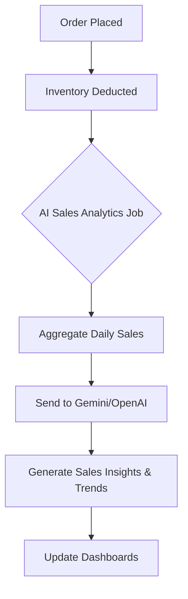

# CommerceIQ AI
## Functional Requirement Document (FRD)

---

## 1. Document Information
| Field | Details |
| :--- | :--- |
| **Document Name** | CommerceIQ AI Functional Requirement Document (FRD) |
| **Project Name** | CommerceIQ AI |
| **Document Owner** | Senior Functional Business Analyst |
| **Status** | Draft |
| **Creation Date** | 2026-06-24 |
| **Last Modified Date**| 2026-06-24 |

---

## 2. Revision History
| Version | Date | Author | Description of Changes |
| :--- | :--- | :--- | :--- |
| 1.0 | 2026-06-24 | Senior BA | Initial FRD generation based on stakeholder requirements and BRD |

---

## 3. Purpose of the Document
The purpose of this Functional Requirement Document (FRD) is to define the required features, system behavior, and functional workflows for the CommerceIQ AI platform. This document serves as the primary reference for the Development Team, QA Team, UI/UX Team, Solution Architect, and Product Manager to ensure alignment on system capabilities before proceeding to SRS, HLD, LLD, and Agile Sprint Planning.

---

## 4. Project Overview
CommerceIQ AI is an AI-Powered E-Commerce Administration & Business Intelligence Platform. It leverages Next.js, Node.js, PostgreSQL, and AI APIs (OpenAI, Gemini) to provide an intelligent SaaS solution for e-commerce management. The platform aims to automate catalog creation, optimize inventory, and provide deep sales analytics.

---

## 5. Business Goals
*   Provide a robust, multi-tenant administrative backend for e-commerce vendors.
*   Automate manual e-commerce operations (product descriptions, SEO) using AI.
*   Enable predictive decision-making via AI Inventory Forecasting and Sales Analytics.
*   Ensure a highly secure, scalable, and responsive application architecture.

---

## 6. Functional Scope
The scope includes the development of Authentication, User Management, Vendor Management, Product Management, Inventory Management, Order Management, Refund Management, Customer Management, Dashboards, and deep integration of AI Modules. Payment processing and storefront customer UIs are excluded from this phase.

---

## 7. System Overview
*   **Frontend:** Next.js application styled with Tailwind CSS, utilizing TypeScript for type safety.
*   **Backend:** Express.js REST APIs running on Node.js.
*   **Database:** PostgreSQL for relational data storage.
*   **Security:** JWT-based authentication with refresh tokens.
*   **AI Integrations:** OpenAI and Gemini APIs for generative and analytical capabilities.

---

## 8. User Roles and Responsibilities
| Role | Responsibility |
| :--- | :--- |
| **Super Admin** | Full system control, global analytics, vendor approval, user management. |
| **Vendor Admin** | Storefront operations, product/inventory/order management, vendor-specific AI insights. |
| **Support Staff** | View orders, handle refund workflows, manage customer interactions. |
| **System** | Automated background jobs, AI API orchestration, notifications. |

---

## 9. Module-Wise Functional Requirements

### 9.1 Authentication Module

**REQ-AUTH-01: Login**
*   **Module Name:** Authentication
*   **Requirement Name:** User Login Authentication
*   **Description:** The system shall authenticate users using an email and password combination, returning a JWT.
*   **Actor:** All Users
*   **Preconditions:** User must have a registered and active account.
*   **Main Flow:** User enters credentials -> System validates against DB -> System generates JWT and Refresh Token -> System redirects to respective dashboard.
*   **Alternate Flow:** Invalid credentials -> System displays error message. Account locked -> System prompts password reset.
*   **Post Conditions:** User session is established securely.
*   **Priority:** High
*   **Acceptance Criteria:** Successful login grants access based on RBAC. Passwords must be hashed. Token expiration handled smoothly.

**REQ-AUTH-02: Role-Based Access Control (RBAC)**
*   **Module Name:** Authentication
*   **Requirement Name:** RBAC Enforcement
*   **Description:** The system must restrict UI components and API endpoints based on the logged-in user's role.
*   **Actor:** System
*   **Preconditions:** User is authenticated and possesses a valid JWT containing role claims.
*   **Main Flow:** User requests resource -> System decodes JWT -> Validates role against resource permissions -> Grants access.
*   **Alternate Flow:** User lacks permission -> System returns 403 Forbidden.
*   **Post Conditions:** Resource access is securely managed.
*   **Priority:** High
*   **Acceptance Criteria:** Vendor cannot access Super Admin settings. Support Staff cannot delete products.

*(Registration and Forgot Password follow similar standard workflows).*

### 9.2 Vendor Management Module

**REQ-VEND-01: Vendor Registration & Approval**
*   **Module Name:** Vendor Management
*   **Requirement Name:** Vendor Onboarding Workflow
*   **Description:** Vendors can register their business, but require Super Admin approval to become active.
*   **Actor:** Vendor, Super Admin
*   **Preconditions:** None for registration. Super Admin must be logged in for approval.
*   **Main Flow:** Vendor submits details -> Status set to 'Pending' -> Super Admin reviews -> Status changed to 'Active' -> Notification sent to Vendor.
*   **Alternate Flow:** Super Admin rejects application -> Status set to 'Rejected' -> Notification sent with reason.
*   **Post Conditions:** Vendor profile is created; login access is granted if approved.
*   **Priority:** High
*   **Acceptance Criteria:** Only 'Active' vendors can access the Vendor Dashboard and add products.

### 9.3 Product Management Module

**REQ-PROD-01: Add Product**
*   **Module Name:** Product Management
*   **Requirement Name:** Create New Product Listing
*   **Description:** Vendors must be able to create products with title, description, price, SKU, category, and images.
*   **Actor:** Vendor Admin
*   **Preconditions:** Vendor account is active.
*   **Main Flow:** Vendor clicks 'Add Product' -> Fills form -> System validates SKU uniqueness -> Saves to DB -> Displays success message.
*   **Alternate Flow:** SKU already exists -> System displays validation error.
*   **Post Conditions:** Product is available in the catalog and inventory tracking is initialized.
*   **Priority:** High
*   **Acceptance Criteria:** Form must validate all mandatory fields. Images must be uploaded and compressed.

### 9.4 AI Modules

**REQ-AI-01: AI Product Description Generator**
*   **Module Name:** AI Modules
*   **Requirement Name:** Automated Product Description
*   **Description:** System generates a comprehensive product description using OpenAI/Gemini based on basic inputs (Title, Key Features).
*   **Actor:** Vendor Admin
*   **Preconditions:** Vendor is adding or editing a product. API credits are available.
*   **Main Flow:** Vendor inputs Title and keywords -> Clicks 'Generate AI Description' -> System calls AI API -> System populates Description field with AI response -> Vendor reviews.
*   **Alternate Flow:** AI API times out -> System displays error and allows manual entry.
*   **Post Conditions:** SEO-optimized description is loaded into the rich text editor.
*   **Priority:** High
*   **Acceptance Criteria:** Generated text must be >100 words, logically structured, and returned within 5 seconds.

**REQ-AI-02: AI Inventory Forecasting**
*   **Module Name:** AI Modules
*   **Requirement Name:** Predictive Stock Depletion Analysis
*   **Description:** The system analyzes 90-day historical sales data to forecast when a product will run out of stock.
*   **Actor:** Vendor Admin, System
*   **Preconditions:** Product has at least 30 days of sales history.
*   **Main Flow:** System cron job aggregates daily sales -> Sends data payload to AI API -> AI returns 'Estimated Days to Depletion' -> System updates DB -> Highlights low stock items on Dashboard.
*   **Alternate Flow:** Insufficient sales data -> System marks forecast as 'N/A'.
*   **Post Conditions:** Inventory dashboard reflects updated predictive metrics.
*   **Priority:** High
*   **Acceptance Criteria:** Forecast accuracy must adapt dynamically; items < 14 days to depletion trigger a visual alert.

**REQ-AI-03: AI Customer Review Sentiment Analysis**
*   **Module Name:** AI Modules
*   **Requirement Name:** Review Sentiment Tagging
*   **Description:** Incoming customer reviews are automatically classified as Positive, Neutral, or Negative.
*   **Actor:** System
*   **Preconditions:** A new review is ingested via API.
*   **Main Flow:** Review payload received -> Passed to AI API -> AI assigns Sentiment Score & Tag -> Saved to DB -> Displayed in Customer Management module.
*   **Alternate Flow:** Review contains unsupported language -> Tagged as 'Manual Review Required'.
*   **Post Conditions:** Review is indexed and affects the product's overall sentiment health score.
*   **Priority:** Medium
*   **Acceptance Criteria:** >90% accuracy in sentiment classification against a baseline dataset.

---

## 10. User Stories
*   **US-101:** As a Vendor, I want to use AI to generate my product descriptions so that I can save time on catalog creation.
*   **US-102:** As a Super Admin, I want to view a centralized revenue dashboard to track platform-wide financial performance.
*   **US-103:** As Support Staff, I want to see the AI sentiment of a customer's recent reviews so I can tailor my communication appropriately.
*   **US-104:** As a Vendor, I want to receive low-stock alerts based on AI forecasting so I don't miss out on potential sales.

---

## 11. Use Case Specifications
**Use Case: Process Refund Workflow**
*   **Trigger:** Customer requests a refund.
*   **Actor:** Support Staff
*   **Normal Flow:** 
    1. Support Staff opens Refund Management module.
    2. Locates Order ID and reviews customer claim.
    3. Clicks 'Approve Refund'.
    4. System calls payment gateway to process reverse transaction.
    5. System updates Order Status to 'Refunded'.
    6. System adjusts inventory (if item is returned).
*   **Exceptions:** Payment gateway rejects refund -> System displays error and sets status to 'Manual Intervention'.

---

## 12. Functional Workflow Diagrams
*(Text Representation for Mermaid Generation)*

---

## 13. Input and Output Specifications
| Screen / API | Input Fields | Output / Response |
| :--- | :--- | :--- |
| **Product Creation** | Title(String), SKU(String), Price(Decimal), Category(ID) | `201 Created`, Product Object JSON |
| **AI Generator** | Prompt(String), Context(String) | `200 OK`, GeneratedText(String) |
| **Sales Dashboard** | DateRange(Date), VendorID(String) | JSON Array of Aggregated Sales Metrics |

---

## 14. Field-Level Validations
| Field | Type | Validation Rule | Error Message |
| :--- | :--- | :--- | :--- |
| Email | String | Must match standard email regex | "Please enter a valid email address." |
| Password | String | Min 8 chars, 1 uppercase, 1 number | "Password does not meet complexity requirements." |
| Price | Decimal | Must be > 0.00 | "Price must be greater than zero." |
| SKU | String | Must be unique per vendor, Alphanumeric | "SKU already exists." |

---

## 15. Business Rules
*   **BR-01:** AI Content generation limits are capped at 500 requests per vendor per month unless on a premium tier.
*   **BR-02:** Inventory adjustments resulting in negative stock are strictly prohibited.
*   **BR-03:** A user session token (JWT) expires strictly after 15 minutes, requiring silent refresh via HttpOnly refresh token.
*   **BR-04:** Vendors can only access data, orders, and reports tied to their specific `vendor_id`.

---

## 16. Exception Handling
*   **AI API Failures:** If OpenAI/Gemini is down, the system gracefully degrades by hiding AI buttons and falling back to manual entry inputs.
*   **Database Timeouts:** Retries transactional queries 3 times with exponential backoff before throwing a `503 Service Unavailable` error to the frontend.

---

## 17. Error Handling Requirements
*   All backend errors must return a standardized JSON format: `{ "error_code": "ERR-XXX", "message": "Human readable message" }`.
*   Frontend must implement global error boundaries to prevent blank screens during React rendering crashes.
*   Sensitive DB errors (e.g., PostgreSQL syntax errors) must never be leaked to the client response.

---

## 18. Notification Requirements
*   **In-App Alerts:** Real-time toast notifications for successful actions (e.g., "Product Saved").
*   **Email Notifications:** Critical events (Vendor Approved, Password Reset, High-Value Order Received) utilizing NodeMailer or equivalent SaaS.
*   **System Alerts:** Slack integration for Super Admins regarding unhandled backend exceptions.

---

## 19. Reporting Requirements
*   **Format:** Exportable to CSV and PDF formats via the UI.
*   **Vendor Reports:** Monthly Sales Summary, Inventory Valuation, Top 10 Selling Products.
*   **Platform Reports:** Global GMV (Gross Merchandise Value), AI API Usage & Cost per Vendor.

---

## 20. Audit Requirements
*   All data modifications (POST, PUT, DELETE) must be tracked via an `audit_logs` PostgreSQL table.
*   Audit entries must contain: `timestamp`, `user_id`, `action`, `table_affected`, `old_value`, `new_value`, `ip_address`.

---

## 21. Security Requirements
*   **Transport Layer:** All traffic forced over HTTPS (TLS 1.3).
*   **Application Layer:** Next.js must sanitize inputs to prevent XSS. Express backend must use parameterized queries to prevent SQL Injection.
*   **Authentication:** JWT secrets must be rotated regularly. Refresh tokens must be stored as secure HttpOnly cookies.

---

## 22. Acceptance Criteria (Platform Level)
*   The application passes all OWASP Top 10 automated security scans.
*   The Next.js frontend scores > 90 on Google Lighthouse (Performance, Accessibility, SEO).
*   AI generation responses average < 5 seconds under normal API load conditions.

---

## 23. Functional Dependency Matrix
| Feature | Depends On | Reason |
| :--- | :--- | :--- |
| **Order Management** | Product Management | Cannot place orders without products. |
| **AI Inventory Forecast** | Order Management | Requires historical sales data to run predictive models. |
| **Vendor Dashboard** | Vendor Approval | Data cannot be displayed until vendor is active. |

---

## 24. Traceability Matrix
| Business Goal (BRD) | Functional Requirement (FRD) | Module |
| :--- | :--- | :--- |
| Automate Content | REQ-AI-01: AI Product Description | AI Modules |
| Prevent Stockouts | REQ-AI-02: AI Inventory Forecasting | Inventory / AI |
| Secure Platform | REQ-AUTH-02: RBAC Enforcement | Authentication |

---

## 25. Assumptions
*   Third-party APIs (OpenAI, Gemini) will maintain their current schema and latency profiles.
*   Deployment infrastructure on Vercel and Render will support the necessary traffic volume without architectural changes during Phase 1.
*   The business logic does not require integration with physical POS (Point of Sale) systems.

---

## 26. Constraints
*   **Budget:** AI API consumption must be monitored and optimized to stay within operating budget.
*   **Timeline:** The Sprint Planning will be constrained by a fixed release date, prioritizing core CRUD and MVP AI features over advanced 'nice-to-have' analytics in the initial launch.
*   **Tech Stack:** Must strictly adhere to the requested stack (Next.js, Node.js, PostgreSQL); no NoSQL databases permitted for this phase.

---
**End of Document**
