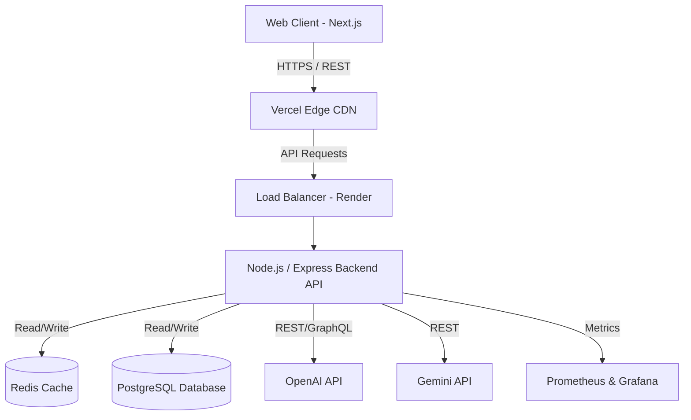
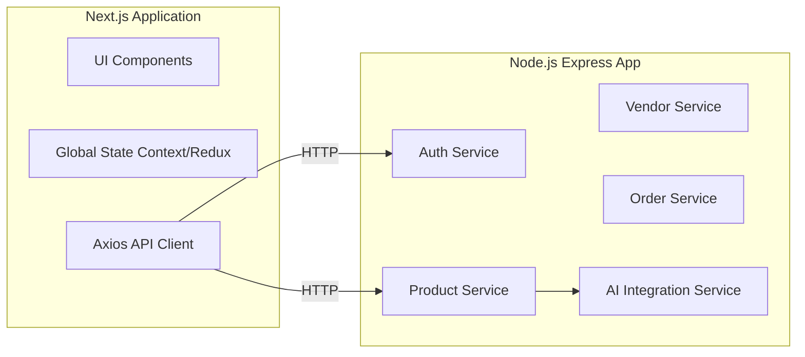
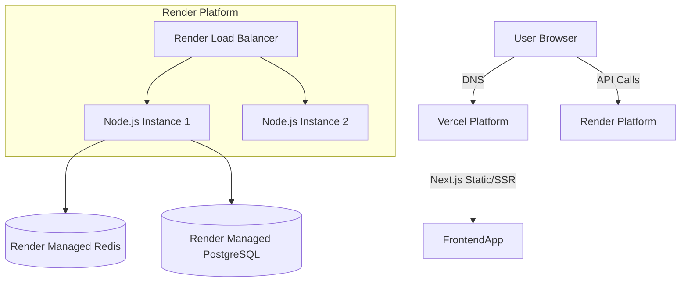
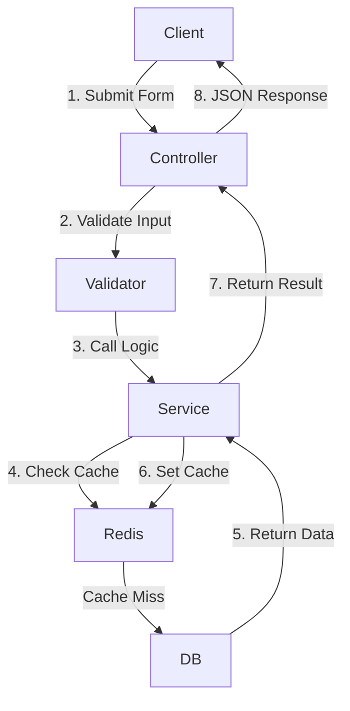
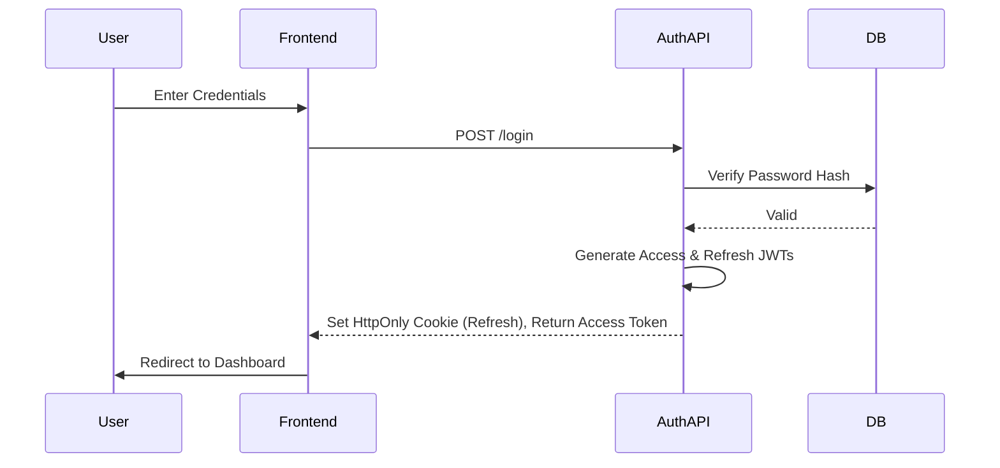
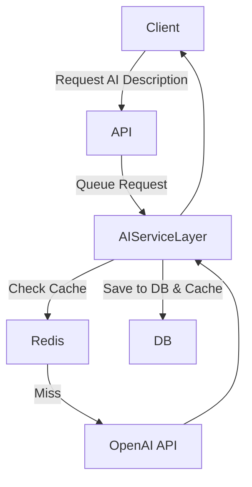
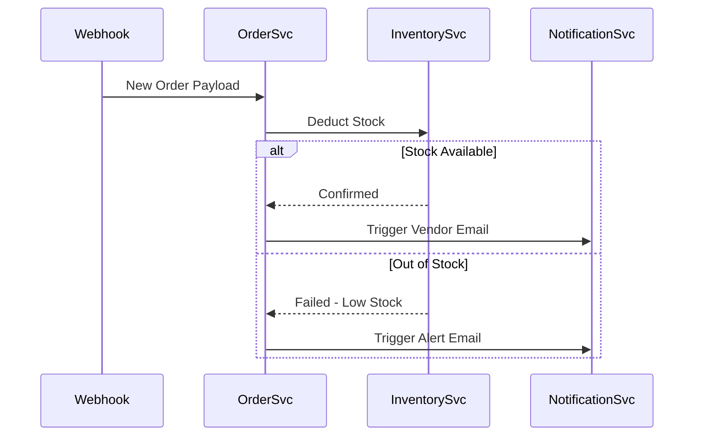

# CommerceIQ AI
## High-Level Design (HLD) Document

---

## 1. Document Information
| Field | Details |
| :--- | :--- |
| **Document Name** | High-Level Design (HLD) Document |
| **Project Name** | CommerceIQ AI |
| **Document Owner** | Senior Solution Architect |
| **Status** | Draft |
| **Creation Date** | 2026-06-24 |
| **Last Modified Date**| 2026-06-24 |

---

## 2. Purpose
The purpose of this High-Level Design (HLD) document is to provide a comprehensive architectural overview of the CommerceIQ AI platform. It defines the system's structure, technology stack, deployment models, and interaction paradigms between various components and AI services. This document serves as the foundational blueprint for Technical Leads, DevOps, and Full Stack Developers.

---

## 3. Scope
This document covers the high-level architecture of the CommerceIQ AI SaaS platform, including the Next.js frontend, Node.js backend, PostgreSQL database, Redis caching, and integrations with OpenAI and Gemini APIs. It outlines the architectural patterns, security strategies, and scalability mechanisms required to support the platform's core business modules and AI features.

---

## 4. Assumptions
*   OpenAI and Gemini APIs will remain accessible and provide low-latency responses.
*   The initial deployment targets moderate scale; however, the architecture must support horizontal scaling.
*   The team size is fixed at 5 developers, requiring a streamlined CI/CD pipeline and manageable infrastructure (Vercel/Render).
*   External systems (e.g., payment gateways) will provide reliable webhooks.

---

## 5. Constraints
*   **Time & Resources:** Development is constrained to a 5-developer team, favoring a Modular Monolith over microservices to reduce operational overhead.
*   **Infrastructure:** Backend must be deployable on Render; Frontend on Vercel.
*   **Cost:** AI API token consumption must be optimized to prevent runaway operational costs.

---

## 6. System Overview
CommerceIQ AI is a cloud-native, AI-powered e-commerce administration and Business Intelligence SaaS. It utilizes a layered RESTful architecture where a Next.js (React) client communicates with an Express.js backend. The backend interfaces with a PostgreSQL relational database for persistent storage, Redis for fast-access caching, and external AI providers for intelligent content generation and predictive analytics.

---

## 7. Architectural Goals
*   **Modularity:** Clean separation of concerns using a modular monolith approach, preparing for future microservice extraction.
*   **Performance:** Sub-second API response times utilizing Redis caching.
*   **Scalability:** Stateless backend design allowing horizontal scaling across multiple instances.
*   **Security:** Defense-in-depth approach utilizing JWT, HTTPS, and OWASP best practices.
*   **Maintainability:** Strong typing (TypeScript) and comprehensive logging (Winston, Grafana).

---

## 8. High-Level Architecture Diagram

---

## 9. Solution Architecture
The solution employs a **Modular Monolith** pattern. The application runs as a single deployable unit but is logically divided into distinct modules (Authentication, Product, Order, AI Services). This balances the simplicity needed by a 5-person team with the separation required for enterprise scalability.

---

## 10. Application Architecture
The backend application follows a standard **Layered Architecture**:
1.  **Presentation/Route Layer:** Express routers handling HTTP request/response.
2.  **Controller Layer:** Orchestrates data flow between requests and services.
3.  **Service/Business Logic Layer:** Contains all business rules and AI orchestrations.
4.  **Data Access Layer (Repository):** Interfaces directly with PostgreSQL and Redis.

---

## 11. Component Architecture

---

## 12. Deployment Architecture

---

## 13. Infrastructure Architecture
*   **Frontend Hosting:** Vercel (Edge network, automated deployments).
*   **Backend Hosting:** Render Web Services (Dockerized Node.js environment).
*   **Database Hosting:** Render Managed PostgreSQL (High Availability, automated backups).
*   **Cache:** Render Managed Redis.

---

## 14. Network Architecture
All communication between the client and backend occurs over public internet secured via TLS 1.3 (HTTPS). Backend to Database/Redis communication occurs over a private VPC internal network within the Render infrastructure, ensuring data is not exposed to the public internet.

---

## 15. Security Architecture
*   **Authentication:** JWT-based. Short-lived Access Tokens (15 min); long-lived Refresh Tokens (7 days) stored in `HttpOnly` secure cookies.
*   **RBAC:** Middleware validates roles (Super Admin, Vendor, Analyst) before hitting controllers.
*   **Data Encryption:** TLS in transit; AES-256 for sensitive DB columns at rest.
*   **API Security:** Rate limiting via Redis. Helmet.js for secure HTTP headers.
*   **OWASP:** Input validation/sanitization via `Joi` or `Zod` to prevent SQL Injection and XSS.

---

## 16. Data Flow Architecture

---

## 17. Authentication Flow

---

## 18. Authorization Flow
1.  Client attaches Access Token to `Authorization: Bearer <token>` header.
2.  Express Middleware verifies signature using the secret key.
3.  Middleware extracts the `role` from the token payload.
4.  Middleware checks if the `role` is permitted for the requested route.
5.  If authorized, `next()` is called; else `403 Forbidden` is returned.

---

## 19. Integration Architecture
*   **AI Services Integration:** Synchronous REST calls to OpenAI/Gemini endpoints. Configured with a circuit breaker pattern and automatic retries using exponential backoff.
*   **Webhook Integrations:** Dedicated controllers to accept incoming order data from external storefronts.

---

## 20. Logging & Monitoring Architecture
*   **Logging:** Winston logger is used to stream application logs. Error logs include stack traces, timestamps, and request IDs.
*   **Monitoring:** Custom metrics exposed via `/metrics` endpoint using `prom-client`.
*   **Visualization:** Prometheus scrapes metrics, visualized on Grafana dashboards (CPU, Memory, API Latency, AI Token Usage).

---

## 21. Error Handling Architecture
A global error handling middleware sits at the end of the Express chain.
*   Catches unhandled promise rejections.
*   Transforms internal errors (e.g., PostgreSQL `UniqueViolation`) into safe, user-friendly JSON responses (e.g., `409 Conflict: Record already exists`).
*   Logs the original stack trace securely via Winston.

---

## 22. Caching Strategy
*   **Entity:** Redis.
*   **Strategy:** Cache-Aside.
*   **Use Cases:** 
    1.  Frequently accessed, rarely changing data (e.g., Categories).
    2.  Aggregated Dashboard Metrics (cached for 15 minutes).
    3.  Rate Limiter storage.
*   **Invalidation:** Event-driven invalidation (e.g., updating a product flushes the cache for that product's ID).

---

## 23. Scalability Strategy
*   **Horizontal Scaling:** Node.js servers are stateless. Render's auto-scaler provisions additional instances based on CPU utilization > 70%.
*   **Load Balancing:** Handled natively by Render.
*   **Database Optimization:** Read-replicas will be introduced if read-heavy traffic (analytics) impacts transactional performance.

---

## 24. Availability & Reliability Strategy
*   **Stateless Backend:** Instance failure does not result in lost user sessions (sessions are JWT/Redis based).
*   **Circuit Breakers:** If OpenAI APIs fail consecutively, the system falls back to manual entry workflows rather than hanging the application.

---

## 25. Disaster Recovery Strategy
*   **RPO (Recovery Point Objective):** 1 Hour.
*   **RTO (Recovery Time Objective):** 4 Hours.
*   **Strategy:** Automated daily snapshots of PostgreSQL database retained for 30 days. Infrastructure-as-code (GitHub Actions) allows immediate redeployment of the application stack to an alternate region if needed.

---

## 26. API Architecture
*   **Style:** RESTful.
*   **Format:** JSON payloads.
*   **Versioning:** URI versioning (e.g., `/api/v1/products`).
*   **Documentation:** Swagger/OpenAPI specification generated automatically.

---

## 27. Database Architecture
*   **System:** PostgreSQL.
*   **Table Grouping:** 
    *   *Identity Group:* Users, Roles, Permissions, Vendors.
    *   *Catalog Group:* Products, Categories, Variants, Inventory.
    *   *Commerce Group:* Orders, Refunds, Customers.
*   **Indexing Strategy:** B-Tree indexes on Primary Keys (UUIDs), Foreign Keys, and frequently queried columns (e.g., `sku`, `email`, `status`).
*   **Query Optimization:** Use of materialized views for complex AI Sales Analytics dashboards.
*   **Backup:** Point-in-time recovery (PITR) enabled.

---

## 28. AI Integration Architecture
The **AI Service Layer** acts as an abstraction wrapper around OpenAI and Gemini SDKs.
*   Abstracts prompt engineering and token management.
*   Implements caching for identical AI requests to save API costs.
*   Handles rate limiting imposed by third-party providers.

---

## 29. Module Interaction Diagram (Order Processing)

---

## 30. Deployment Flow
1.  Developer pushes code to GitHub `main` branch.
2.  **GitHub Actions CI:** Runs Linting, TypeScript compilation, and Unit Tests.
3.  If CI passes:
    *   Frontend triggers Vercel deployment hook.
    *   Backend triggers Render deployment hook.
4.  Render pulls latest image, runs database migrations (`knex` or `prisma`), and restarts the Node.js service.
5.  New version is live with zero downtime.

---
**End of Document**
