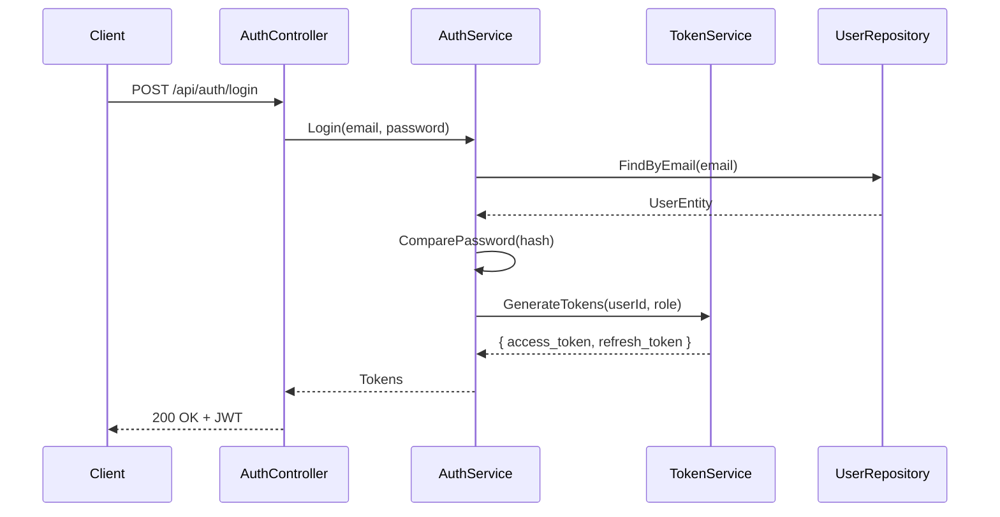
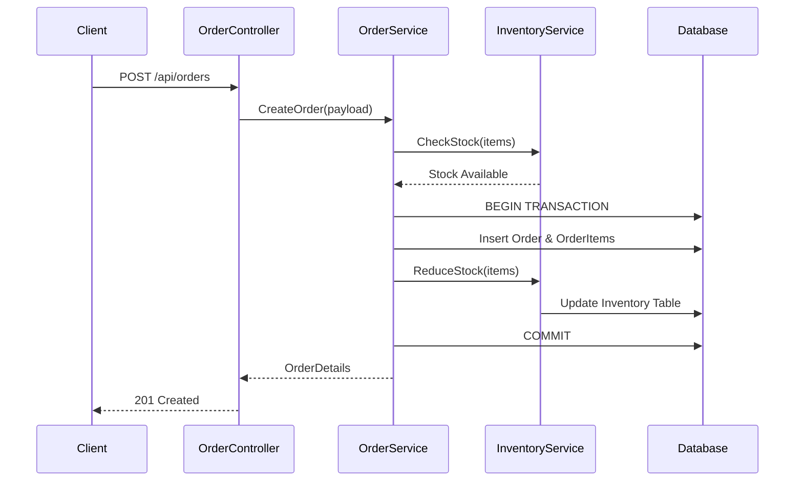
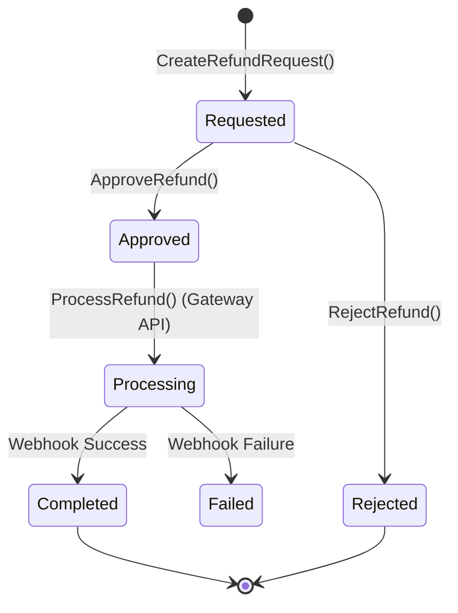
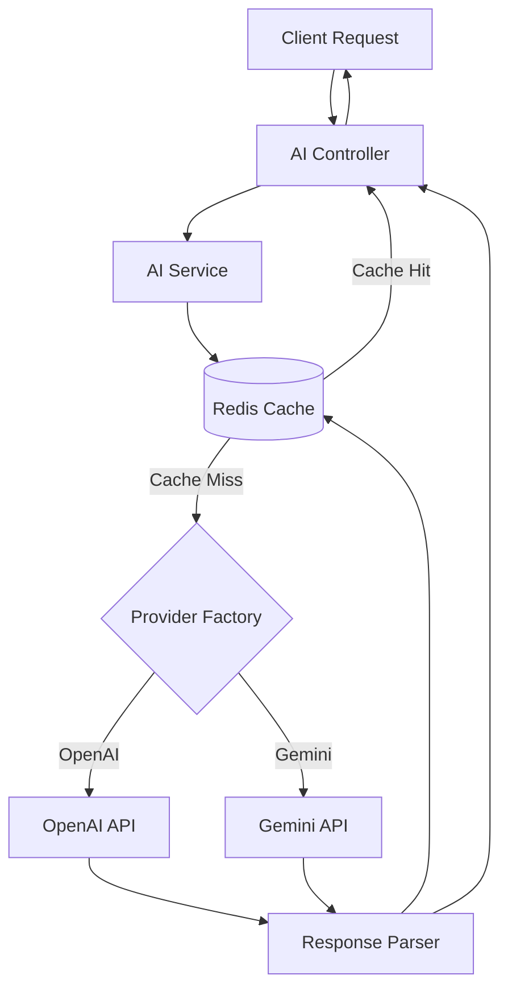
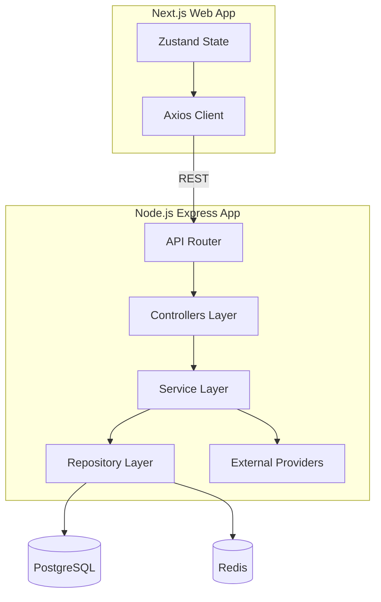
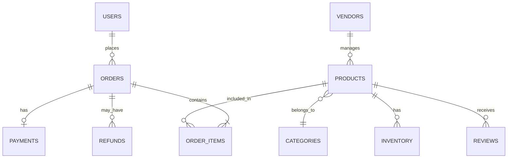

# CommerceIQ AI
## Low-Level Design (LLD) Document

---

## 1. Document Information
| Field | Details |
| :--- | :--- |
| **Document Name** | Low-Level Design (LLD) Document |
| **Project Name** | CommerceIQ AI |
| **Document Owner** | Senior Software Architect / Tech Lead |
| **Status** | Draft |
| **Creation Date** | 2026-06-24 |

---

## 2. Purpose
The purpose of this Low-Level Design (LLD) document is to provide a granular technical blueprint for the CommerceIQ AI platform. It specifies the internal logic, class structures, database schemas, API contracts, and detailed workflows for developers to implement the system.

## 3. Scope
This document covers the low-level design of the Node.js/Express.js backend, including module design (Auth, User, Vendor, Product, Inventory, Order, Refund, Customer, Dashboard, AI), Service/Repository patterns, Database schemas (PostgreSQL), and AI Service integrations. 

## 4. Assumptions
* Developers are proficient in TypeScript, Express.js, and PostgreSQL.
* The system utilizes a generic BaseRepository for common CRUD operations.
* External APIs (OpenAI, Gemini) have standard REST/JSON interfaces.

## 5. Constraints
* Must adhere strictly to the Layered Modular Monolith architecture.
* TypeOrm or Prisma will be used as the ORM to implement the Repository pattern.

## 6. Coding Standards
* **Language:** TypeScript strictly typed (`strict: true` in `tsconfig.json`).
* **Naming Conventions:** Classes/Interfaces -> `PascalCase`, Methods/Variables -> `camelCase`, DB Tables -> `snake_case` plural.
* **Linting:** ESLint + Prettier enforced via Husky pre-commit hooks.

## 7. Folder Structure
```text
src/
├── config/           # App configuration (DB, Redis, Env vars)
├── core/             # Custom Exceptions, Base Interfaces, Middlewares
├── modules/          # Feature Modules (Auth, Product, Order, etc.)
│   ├── auth/
│   │   ├── controllers/
│   │   ├── services/
│   │   ├── repositories/
│   │   ├── dtos/
│   │   └── entities/
├── utils/            # Helper functions (Logger, Hash)
└── app.ts            # Express App entry point
```

## 8. Project Structure
The project follows a Modular Monolith structure where each business domain encapsulates its own controller, service, repository, and entities, connected through a central Express router.

## 9. Layered Architecture Design
* **Router Layer:** Maps endpoints to controllers.
* **Controller Layer:** Handles HTTP requests, DTO validation, and HTTP responses.
* **Service Layer:** Contains business logic and transactional boundaries.
* **Repository Layer:** Handles database queries and ORM mapping.

## 10-15. Design Patterns
* **Module Design:** Independent domains communicating via DI (Dependency Injection).
* **Class/Service/Repository Design:** Services inject repositories. Controllers inject services.
* **DTO Design:** Data Transfer Objects validate incoming payloads using `class-validator` or `zod`.
* **Entity Design:** ORM decorators map TypeScript classes to PostgreSQL tables.

## 16. Middleware Design
* `JwtMiddleware`: Validates `Authorization` header.
* `RoleMiddleware`: Checks user roles against route permissions.
* `ErrorMiddleware`: Catches exceptions and formats standard error responses.

## 17. Validation Design
Payloads are validated at the Controller layer before reaching the Service layer, rejecting malformed requests with `400 Bad Request`.

## 18. API Request Flow
Request -> Rate Limiter -> Auth Middleware -> Role Middleware -> DTO Validation -> Controller -> Service -> Repository -> Database -> (Return path).

---

# MODULE-WISE LLD

## 1. AUTHENTICATION MODULE

### Classes & Methods
*   **UserController:** `GetUserProfile()`, `UpdateProfile()`
*   **AuthController:** `Register()`, `Login()`, `RefreshToken()`, `ForgotPassword()`, `ResetPassword()`, `Logout()`
*   **AuthService:** Core logic for password hashing, token generation, and user validation.
*   **TokenService:** Manages JWT signing, verification, and Redis refresh token storage.
*   **UserRepository:** Database operations for the `Users` table.
*   **JwtMiddleware:** Intercepts requests to validate tokens.

### Validation Rules
*   `RegisterDTO`: Email must be valid; Password must contain >= 8 chars, 1 number, 1 uppercase.
*   `LoginDTO`: Email format valid; Password required.

### Authentication Flow Diagram


---

## 2. PRODUCT MODULE

### Classes & Methods
*   **ProductController:** `CreateProduct()`, `UpdateProduct()`, `DeleteProduct()`, `GetProductById()`, `SearchProducts()`
*   **ProductService:** Handles business rules (e.g., auto-generating SKU if missing, validating category).
*   **ProductRepository:** Executes DB transactions.
*   **ProductValidator:** DTO definitions for Product schemas.

### CRUD Flow
1. **Create:** Client POSTs -> `ProductValidator` validates -> `ProductService` formats data -> `ProductRepository` saves -> Returns 201.
2. **Search:** Client GETs `/search?q=phone` -> Service builds dynamic query -> Repository executes `ILIKE` or full-text search.

---

## 3. ORDER MODULE

### Classes & Methods
*   **OrderController:** `CreateOrder()`, `UpdateOrderStatus()`, `CancelOrder()`, `GetOrderHistory()`
*   **OrderService:** Orchestrates inventory deduction, payment verification, and order creation within a DB transaction.
*   **OrderRepository:** Stores Order and OrderItem entities.
*   **PaymentService:** Interfaces with external payment gateways.

### Order Processing Flow Diagram


---

## 4. INVENTORY MODULE

### Classes & Methods
*   **InventoryController:** Route handlers for stock.
*   **InventoryService:** `AddStock()`, `ReduceStock()`, `UpdateStock()`, `GenerateLowStockAlert()`
*   **InventoryRepository:** DB operations with pessimistic locking during deductions.

### Validation Rules
*   Stock cannot be reduced below zero (`ReduceStock` throws `BusinessRuleException` if `qty > current_stock`).

---

## 5. REFUND MODULE

### Classes & Methods
*   **RefundController:** `CreateRefundRequest()`, `ApproveRefund()`, `RejectRefund()`, `ProcessRefund()`
*   **RefundService:** Business logic for determining refund eligibility.
*   **RazorpayService:** Integration with payment gateway to execute the reverse transaction.

### Refund Processing Flow Diagram


---

## 6. AI MODULE

### Classes & Methods
*   **AIController:** API endpoints for AI features.
*   **AIService:** Orchestrator deciding which provider to use.
*   **OpenAIProvider / GeminiProvider:** Concrete implementations of an `IAIProvider` interface.
*   **Features:** `GenerateProductDescription()`, `GenerateSEOContent()`, `AnalyzeSalesData()`, `PredictInventoryDemand()`, `AnalyzeCustomerReviews()`

### AI Processing Flow Diagram


---

## 7. COMPONENT DIAGRAM


---

## DATABASE DESIGN (ERD & Schemas)



### 1. Users
| Column | Type | Constraints |
| :--- | :--- | :--- |
| `id` | UUID | PK |
| `email` | VARCHAR(255) | UNIQUE, NOT NULL |
| `password_hash`| VARCHAR | NOT NULL |
| `role_id` | UUID | FK -> Roles.id |

### 2. Vendors
| Column | Type | Constraints |
| :--- | :--- | :--- |
| `id` | UUID | PK |
| `user_id` | UUID | FK -> Users.id, UNIQUE |
| `business_name`| VARCHAR(255) | NOT NULL |
| `status` | VARCHAR(50) | DEFAULT 'Pending' |

### 3. Products
| Column | Type | Constraints |
| :--- | :--- | :--- |
| `id` | UUID | PK |
| `vendor_id` | UUID | FK -> Vendors.id |
| `category_id` | UUID | FK -> Categories.id |
| `sku` | VARCHAR(100) | UNIQUE, NOT NULL |
| `title` | VARCHAR(255) | NOT NULL |
| `price` | DECIMAL(10,2) | NOT NULL |

*(Other tables include Categories, Inventory, Orders, OrderItems, Payments, Refunds, Reviews, Notifications, AuditLogs following standard normalized relational schema patterns).*

**Indexes Strategy:**
* B-Tree indexes on `email`, `sku`, `vendor_id`, `category_id`.
* Composite index on OrderItems (`order_id`, `product_id`).

---

## API DESIGN

### Example: Create Product
*   **Endpoint:** `/api/v1/products`
*   **HTTP Method:** `POST`
*   **Request Payload (DTO):**
    ```json
    {
      "title": "Smartphone",
      "sku": "SP-123",
      "price": 699.99,
      "category_id": "uuid"
    }
    ```
*   **Response Payload:**
    ```json
    {
      "status": "success",
      "data": {
        "id": "uuid",
        "title": "Smartphone",
        "created_at": "timestamp"
      }
    }
    ```
*   **Status Codes:** `201 Created`, `400 Bad Request` (Validation Failed), `401 Unauthorized`.

---

## SECURITY DESIGN
*   **JWT Flow:** Access tokens map to `userId` and `role`. Verified via HMAC SHA-256.
*   **Refresh Token Flow:** Stored in DB with expiry. Client sends via HttpOnly Cookie to `/auth/refresh` to get a new Access Token.
*   **Password Hashing:** `bcrypt` with salt rounds = 12.
*   **Rate Limiting:** `express-rate-limit` backed by Redis. Limits: 100 requests / 15 min per IP.

---

## ERROR HANDLING DESIGN

**Custom Exceptions:**
```typescript
class BaseException extends Error {
  constructor(public statusCode: number, public errorCode: string, message: string) { super(message); }
}
class ValidationException extends BaseException { // 400 Bad Request, ERR_VALIDATION }
class AuthenticationException extends BaseException { // 401 Unauthorized, ERR_AUTH }
class AuthorizationException extends BaseException { // 403 Forbidden, ERR_FORBIDDEN }
class BusinessRuleException extends BaseException { // 422 Unprocessable, ERR_BUSINESS }
class DatabaseException extends BaseException { // 500 Server Error, ERR_DB }
```

**Response Structure:**
```json
{
  "success": false,
  "error": {
    "code": "ERR_VALIDATION",
    "message": "Invalid SKU format.",
    "details": ["SKU must be alphanumeric"]
  }
}
```

---

## LOGGING DESIGN
*   **Application Logs:** Using `Winston`. Outputs to stdout (for Render to capture) and structured JSON files.
*   **Audit Logs:** Custom Express middleware logs all `POST`, `PUT`, `DELETE` methods to the `AuditLogs` PostgreSQL table (Tracking UserID, Action, Timestamp).
*   **API Logs:** `Morgan` middleware logs HTTP request methods, URLs, status codes, and response times.

---
**End of Document**
